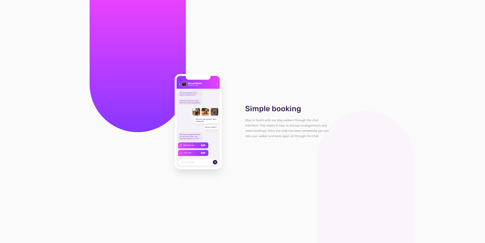

# Frontend Mentor - Chat app CSS illustration solution

This is a solution to the [Chat app CSS illustration challenge on Frontend Mentor](https://www.frontendmentor.io/challenges/chat-app-css-illustration-O5auMkFqY). Frontend Mentor challenges help you improve your coding skills by building realistic projects.

## Table of contents

- [Overview](#overview)
  - [The challenge](#the-challenge)
  - [Screenshot](#screenshot)
  - [Links](#links)
- [My process](#my-process)
  - [Built with](#built-with)

## Overview

### The challenge

Users should be able to:

- View the optimal layout for the component depending on their device's screen size
- **Bonus**: See the chat interface animate on the initial load

### Screenshot

### Links

- Solution URL: TBA
- Live Site URL: [GitHub Pages](https://john-mirage.github.io/chat-app-css-illustration/)

## My process

### Built with

- Semantic HTML5 markup
- Flexbox, Grid
- Mobile-first workflow
- [Vitejs](https://vitejs.dev/) - For toolchain
- [Sass](https://sass-lang.com/) - For styles and theme